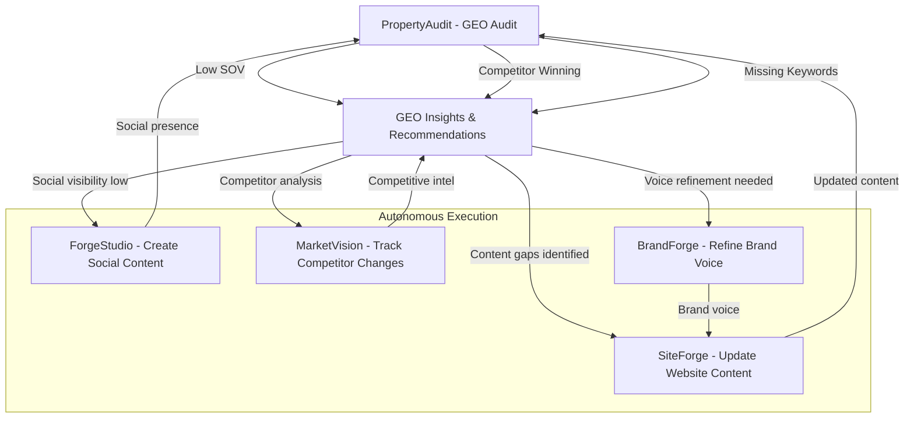
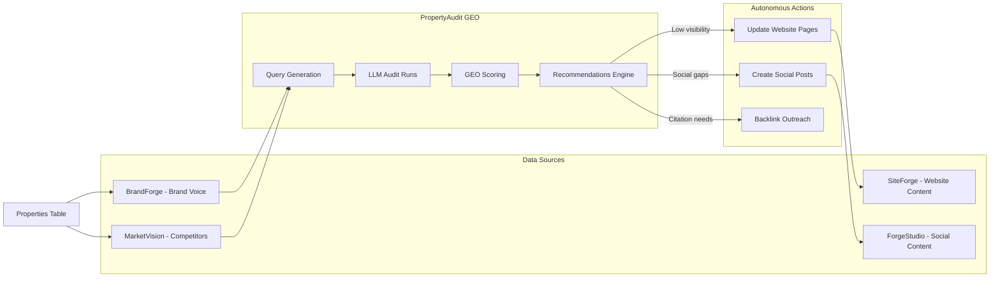

# PropertyAudit vs WebFX OmniSEO - Gap Analysis & Enhancement Roadmap

## Executive Summary

PropertyAudit (GeoTool integration) currently provides **tracking and measurement** of AI visibility. WebFX's OmniSEO offers **tracking + actionable strategy + execution**. P11 has the unique advantage of being an **autonomous agency** that can automatically execute GEO recommendations through existing products.

---

## WebFX OmniSEO Capabilities Breakdown

### Phase 1: GEO Audit (What They Measure)

- How AI models view your brand
- How AI models interpret site content
- Search result variations by AI model
- Which websites AI models cite
- Traffic risk/impact from AI search
- Prevalence of AI features (Google AI Overviews, etc.)
- Voice search opportunities
- Social search engine visibility

### Phase 2: AI Search Strategy (What They Analyze)

- Most relevant search queries
- Target audience search behavior
- Marketing goals alignment
- SEO opportunities
- Adaptive strategy that evolves with AI

### Phase 3: AI Search Optimization (What They Do)

1. Get listed in AI-referenced databases
2. Refine SEO content for AI results
3. Produce new content for high-value queries
4. Acquire mentions on cited websites
5. Improve cross-platform visibility

---

## What PropertyAudit Currently Has ✅

| Capability | Status | Implementation |

|------------|--------|----------------|

| Track AI model responses | ✅ Complete | OpenAI & Claude connectors |

| Query variations by type | ✅ Complete | 5 query types (branded, category, comparison, local, faq) |

| LLM rank tracking | ✅ Complete | Position in ordered entities |

| Citation tracking | ✅ Complete | Which domains get cited |

| Competitor mentions | ✅ Complete | CompetitorInsights component |

| Score trending | ✅ Complete | Historical run tracking |

| Share of Voice | ✅ Complete | Brand citations / total citations |

| Visual dashboards | ✅ Complete | TrendChart, DumbbellChart, etc. |

| Export reports | ✅ Complete | CSV, Markdown, PDF |

---

## What PropertyAudit is Missing 🔴

| WebFX Capability | Missing in PropertyAudit | P11 Integration Opportunity |

|------------------|--------------------------|----------------------------|

| **Traffic impact prediction** | No traffic forecasting | Integrate with MultiChannel BI data |

| **Voice search tracking** | Not yet implemented | Add voice query types |

| **Social search (TikTok, IG)** | Not tracked | Leverage ForgeStudio social data |

| **Content recommendations** | No actionable output | Generate via ContentAgent |

| **Database listing strategy** | Not automated | Create automated submission workflows |

| **Backlink acquisition plan** | No outreach automation | Could integrate with CRM/outreach |

| **SEO content refinement** | No content editing | **Connect to SiteForge for auto-updates** |

| **Google AI Overviews tracking** | Not included | Add Google Search API integration |

---

## P11's Unique Advantage: The Autonomous Loop

Unlike WebFX (manual agency), P11 can **automatically execute** GEO recommendations:



---

## Enhancement Roadmap

### ✅ Phase 1: Content Recommendations Engine (In Scope - High Priority)

**Goal:** Turn GEO insights into actionable content suggestions

**New Component:** `components/propertyaudit/recommendations/ContentRecommendations.tsx`

Analyzes GEO results and generates:

1. **Missing keyword opportunities** - Queries where brand is absent
2. **Content gap analysis** - Topics competitors cover but you don't
3. **Citation opportunities** - High-authority sites to target
4. **Voice search optimization** - Question-based content suggestions

**API:** `POST /api/propertyaudit/recommendations`

- Input: runId
- Output: Prioritized list of content recommendations with:
  - Suggested page/blog topic
  - Target keywords
  - Competitor analysis
  - Expected visibility impact

**Note:** Recommendations will be **manual action items** (export/copy functionality). No automated execution in this phase.

### ✅ Phase 2: Voice Search Queries (In Scope - High Priority)

**Goal:** Expand beyond text LLMs to voice and conversational search

**Voice Search Implementation:**

- Add voice-optimized queries (question format)
- New query types: "How do I...", "What is the best...", "Where can I find..."
- Track question-based keywords in LLM responses
- Measure conversational query performance

**Files to Update:**

- `utils/propertyaudit/types.ts` - Add voice query type
- Query generation logic - Add question templates

---

## 📦 Deferred Features (Linear Backlog)

The following features have been moved to Linear backlog for future consideration:

### [P11-96] Google AI Overviews Tracking

**Priority:** Medium

**Why Deferred:** Focus on OpenAI/Claude GEO first

**Link:** https://linear.app/p11creative/issue/P11-96

- Add `google-aio` surface type
- SerpAPI integration for Google Search visibility
- Featured snippet tracking

### [P11-97] SiteForge Integration for Auto-Execution

**Priority:** Low

**Why Deferred:** SiteForge ContentAgent is website-specific, needs architecture design

**Link:** https://linear.app/p11creative/issue/P11-97

- Connect recommendations to automated content updates
- Requires general-purpose content generation strategy

### [P11-98] Social Search Integration

**Priority:** Low

**Why Deferred:** Text LLMs are higher priority than social platforms

**Link:** https://linear.app/p11creative/issue/P11-98

- TikTok search visibility
- Instagram search results
- Pinterest recommendations

### [P11-99] Traffic Impact Prediction

**Priority:** Low

**Why Deferred:** GEO visibility is actionable on its own

**Link:** https://linear.app/p11creative/issue/P11-99

- GA4 integration
- Traffic forecasting
- ROI calculation

---

## Integration with P11 Ecosystem

### Data Flow Diagram



### Current P11 Integration Points

1. **BrandForge** → PropertyAudit

   - Provides brand voice, target audience
   - Used in query generation and evaluation
   - Status: ✅ Integrated

2. **MarketVision** → PropertyAudit

   - Provides competitor domains
   - Used in citation analysis
   - Status: ✅ Integrated

3. **Properties** → PropertyAudit

   - Provides property context
   - Auto-generates query panels
   - Status: ✅ Integrated

4. **PropertyAudit** → SiteForge

   - Could trigger content updates
   - Status: ❌ Not connected yet

5. **PropertyAudit** → ForgeStudio

   - Could guide social content topics
   - Status: ❌ Not connected yet

---

## Recommended Next Steps

### ✅ Immediate Implementation (This Sprint)

1. **Build Recommendations Engine**

   - Analyze GEO run results
   - Identify missing keyword opportunities
   - Generate content gap analysis
   - Prioritize by competitive impact
   - Export functionality for manual action

2. **Add Voice Search Queries**

   - Add question-based query templates
   - New query type: `voice_search`
   - Track conversational keyword performance
   - Measure question-format responses

### 📦 Future Enhancements (Linear Backlog)

All other enhancements have been documented as Linear issues for future prioritization:

- **P11-96**: Google AI Overviews tracking
- **P11-97**: SiteForge integration for auto-execution
- **P11-98**: Social search integration (TikTok, Instagram)
- **P11-99**: Traffic impact prediction (GA4 integration)

---

## Key Differentiator from WebFX

**WebFX:** Manual agency → GEO audit → Strategy document → Human execution

**P11:** Autonomous agency → GEO audit → **Auto-generated recommendations** → **Automated execution via agents**

### Example Autonomous Workflow

```
1. PropertyAudit detects: "Best apartments in Denver" - No presence
2. Recommendation Engine: "Create blog post: '10 Best Apartment Amenities in Denver 2025'"
3. User clicks: "Generate Content"
4. SiteForge ContentAgent: Creates SEO-optimized blog post
5. Auto-publishes to WordPress
6. Next GEO audit (1 week later): Visibility improved from 0% to 35%
7. MarketVision: Competitor also responded → Adjust strategy
8. Repeat cycle
```

This creates a **self-improving AI visibility loop** that WebFX can't match.

---

## Files Needed for Implementation

### Recommendations Engine

- `utils/propertyaudit/recommendation-engine.ts` - Core analysis logic
- `components/propertyaudit/recommendations/ContentRecommendations.tsx` - UI component
- `components/propertyaudit/recommendations/index.ts` - Exports
- `app/api/propertyaudit/recommendations/route.ts` - API endpoint

### Voice Search Queries

- Update `utils/propertyaudit/types.ts` - Add `voice_search` query type
- Update query generation logic - Add question-based templates
- Update UI components - Display voice query results

---

## Summary

**Current State:** PropertyAudit = 70% of WebFX OmniSEO (tracking & analysis)

**This Sprint:**

- ✅ Build Recommendations Engine (manual action items)
- ✅ Add Voice Search query types

**Deferred to Backlog:**

- 📦 Google AI Overviews tracking (P11-96)
- 📦 SiteForge integration / auto-execution (P11-97)
- 📦 Social search integration (P11-98)
- 📦 Traffic impact prediction (P11-99)

**Key Decision:** Focus on actionable recommendations first, defer automation/execution to future phases when architecture is better defined.