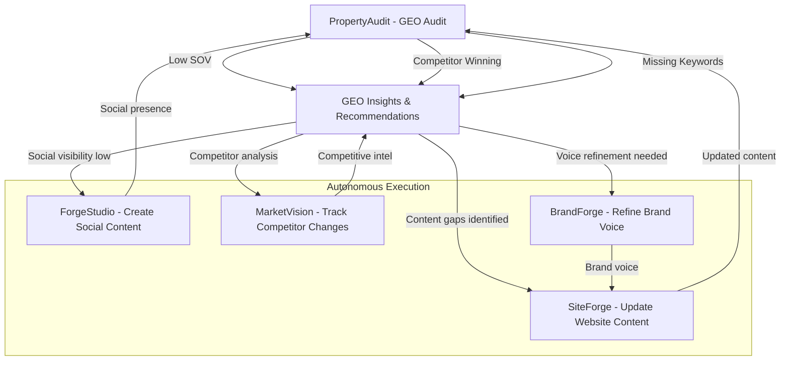
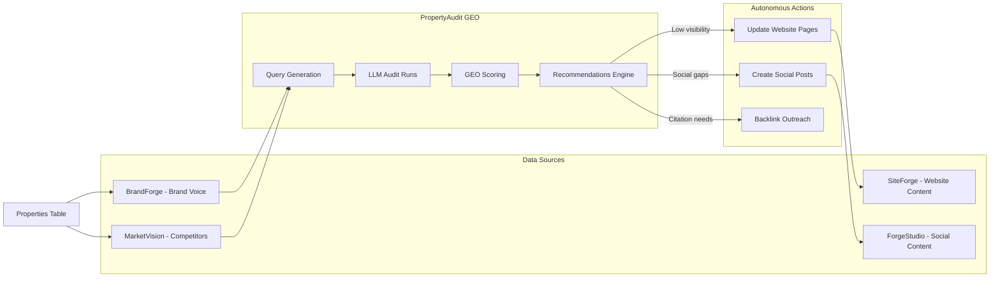

# PropertyAudit vs WebFX OmniSEO - Gap Analysis & Enhancement Roadmap

## Executive Summary

PropertyAudit (GeoTool integration) currently provides **tracking and measurement** of AI visibility. WebFX's OmniSEO offers **tracking + actionable strategy + execution**. P11 has the unique advantage of being an **autonomous agency** that can automatically execute GEO recommendations through existing products.

---

## WebFX OmniSEO Capabilities Breakdown

### Phase 1: GEO Audit (What They Measure)

- How AI models view your brand
- How AI models interpret site content
- Search result variations by AI model
- Which websites AI models cite
- Traffic risk/impact from AI search
- Prevalence of AI features (Google AI Overviews, etc.)
- Voice search opportunities
- Social search engine visibility

### Phase 2: AI Search Strategy (What They Analyze)

- Most relevant search queries
- Target audience search behavior
- Marketing goals alignment
- SEO opportunities
- Adaptive strategy that evolves with AI

### Phase 3: AI Search Optimization (What They Do)

1. Get listed in AI-referenced databases
2. Refine SEO content for AI results
3. Produce new content for high-value queries
4. Acquire mentions on cited websites
5. Improve cross-platform visibility

---

## What PropertyAudit Currently Has ✅

| Capability | Status | Implementation |

|------------|--------|----------------|

| Track AI model responses | ✅ Complete | OpenAI & Claude connectors |

| Query variations by type | ✅ Complete | 5 query types (branded, category, comparison, local, faq) |

| LLM rank tracking | ✅ Complete | Position in ordered entities |

| Citation tracking | ✅ Complete | Which domains get cited |

| Competitor mentions | ✅ Complete | CompetitorInsights component |

| Score trending | ✅ Complete | Historical run tracking |

| Share of Voice | ✅ Complete | Brand citations / total citations |

| Visual dashboards | ✅ Complete | TrendChart, DumbbellChart, etc. |

| Export reports | ✅ Complete | CSV, Markdown, PDF |

---

## What PropertyAudit is Missing 🔴

| WebFX Capability | Missing in PropertyAudit | P11 Integration Opportunity |

|------------------|--------------------------|----------------------------|

| **Traffic impact prediction** | No traffic forecasting | Integrate with MultiChannel BI data |

| **Voice search tracking** | Not yet implemented | Add voice query types |

| **Social search (TikTok, IG)** | Not tracked | Leverage ForgeStudio social data |

| **Content recommendations** | No actionable output | Generate via ContentAgent |

| **Database listing strategy** | Not automated | Create automated submission workflows |

| **Backlink acquisition plan** | No outreach automation | Could integrate with CRM/outreach |

| **SEO content refinement** | No content editing | **Connect to SiteForge for auto-updates** |

| **Google AI Overviews tracking** | Not included | Add Google Search API integration |

---

## P11's Unique Advantage: The Autonomous Loop

Unlike WebFX (manual agency), P11 can **automatically execute** GEO recommendations:



---

## Enhancement Roadmap

### Phase 1: Content Recommendations Engine (High Priority)

**Goal:** Turn GEO insights into actionable content suggestions

**New Component:** `components/propertyaudit/recommendations/ContentRecommendations.tsx`

Analyzes GEO results and generates:

1. **Missing keyword opportunities** - Queries where brand is absent
2. **Content gap analysis** - Topics competitors cover but you don't
3. **Citation opportunities** - High-authority sites to target
4. **Voice search optimization** - Question-based content suggestions

**API:** `POST /api/propertyaudit/recommendations`

- Input: runId
- Output: Prioritized list of content recommendations with:
  - Suggested page/blog topic
  - Target keywords
  - Competitor analysis
  - Expected visibility impact

### Phase 2: SiteForge Integration (High Priority)

**Goal:** Automatically update website content based on GEO insights

**Flow:**

1. PropertyAudit detects low visibility for "luxury apartments [city]"
2. Generates recommendation: "Add amenity page targeting luxury keywords"
3. **NEW:** Button to "Generate Page in SiteForge"
4. SiteForge ContentAgent creates optimized page
5. Next GEO run validates improvement

**Files to create:**

- `app/api/propertyaudit/execute-recommendation/route.ts`
- `utils/propertyaudit/recommendation-engine.ts`

**Integration points:**

- Call SiteForgeOrchestrator with GEO-optimized prompts
- Use ContentAgent to refine existing pages
- Track before/after GEO scores

### Phase 3: Google AI Overviews Tracking (Medium Priority)

**Goal:** Track presence in Google's AI-powered search features

**Implementation:**

- Add `google-aio` surface type (alongside openai/claude)
- Use Google Search API or SerpAPI to capture AI Overview snippets
- Track featured snippet appearances
- Compare traditional SEO vs GEO performance

**Schema update:** Add `google-aio` to `geo_surface_enum`

### Phase 4: Voice & Social Search (Medium Priority)

**Goal:** Expand beyond text LLMs to voice and social platforms

**Voice Search:**

- Add voice-optimized queries (question format)
- Track Google Assistant / Alexa responses
- Measure voice search keywords

**Social Search:**

- TikTok search visibility
- Instagram search results
- Pinterest recommendations
- Leverage ForgeStudio's social content performance

### Phase 5: Traffic Impact Prediction (Low Priority)

**Goal:** Forecast traffic shifts from AI search adoption

**Approach:**

- Integrate with Google Analytics data
- Calculate % of traffic from search queries
- Project impact of AI visibility changes
- Use historical BI data from MultiChannel BI

---

## Integration with P11 Ecosystem

### Data Flow Diagram



### Current P11 Integration Points

1. **BrandForge** → PropertyAudit

   - Provides brand voice, target audience
   - Used in query generation and evaluation
   - Status: ✅ Integrated

2. **MarketVision** → PropertyAudit

   - Provides competitor domains
   - Used in citation analysis
   - Status: ✅ Integrated

3. **Properties** → PropertyAudit

   - Provides property context
   - Auto-generates query panels
   - Status: ✅ Integrated

4. **PropertyAudit** → SiteForge

   - Could trigger content updates
   - Status: ❌ Not connected yet

5. **PropertyAudit** → ForgeStudio

   - Could guide social content topics
   - Status: ❌ Not connected yet

---

## Recommended Next Steps

### Immediate (Week 1)

1. **Add Recommendations Engine**

   - Analyze GEO gaps
   - Generate content suggestions
   - Prioritize by traffic impact

2. **Connect to SiteForge**

   - "Generate optimized page" button
   - Pass GEO insights to ContentAgent
   - Measure before/after

### Short-term (Week 2-3)

3. **Add Google AI Overviews**

   - New surface type
   - SerpAPI integration
   - Featured snippet tracking

4. **Voice Search Queries**

   - Question-based query type
   - Voice assistant tracking

### Medium-term (Month 2)

5. **Social Search Integration**

   - TikTok search visibility
   - Instagram hashtag presence
   - Connect to ForgeStudio

6. **Traffic Impact Dashboard**

   - GA4 integration
   - Search traffic forecasting
   - ROI calculation

---

## Key Differentiator from WebFX

**WebFX:** Manual agency → GEO audit → Strategy document → Human execution

**P11:** Autonomous agency → GEO audit → **Auto-generated recommendations** → **Automated execution via agents**

### Example Autonomous Workflow

```
1. PropertyAudit detects: "Best apartments in Denver" - No presence
2. Recommendation Engine: "Create blog post: '10 Best Apartment Amenities in Denver 2025'"
3. User clicks: "Generate Content"
4. SiteForge ContentAgent: Creates SEO-optimized blog post
5. Auto-publishes to WordPress
6. Next GEO audit (1 week later): Visibility improved from 0% to 35%
7. MarketVision: Competitor also responded → Adjust strategy
8. Repeat cycle
```

This creates a **self-improving AI visibility loop** that WebFX can't match.

---

## Files Needed for Full WebFX Parity

### Recommendations Engine

- `utils/propertyaudit/recommendation-engine.ts` - Core logic
- `components/propertyaudit/recommendations/ContentRecommendations.tsx` - UI
- `app/api/propertyaudit/recommendations/route.ts` - API

### SiteForge Integration

- `app/api/propertyaudit/execute-recommendation/route.ts` - Trigger content generation
- Update `SiteForgeOrchestrator` to accept GEO context

### Google AI Overviews

- `utils/propertyaudit/google-aio-connector.ts` - SerpAPI integration
- Update schema: Add `google-aio` to `geo_surface_enum`

### Voice Search

- Add voice query templates to query generation
- Track question-based keywords

---

## Summary

**Current State:** PropertyAudit = 70% of WebFX OmniSEO (tracking & analysis)

**Missing:** Content recommendations, execution automation, voice/social search

**P11 Advantage:** Can automatically execute recommendations through existing agents

**Next Priority:** Build the Recommendations Engine + SiteForge connection to complete the autonomous loop.