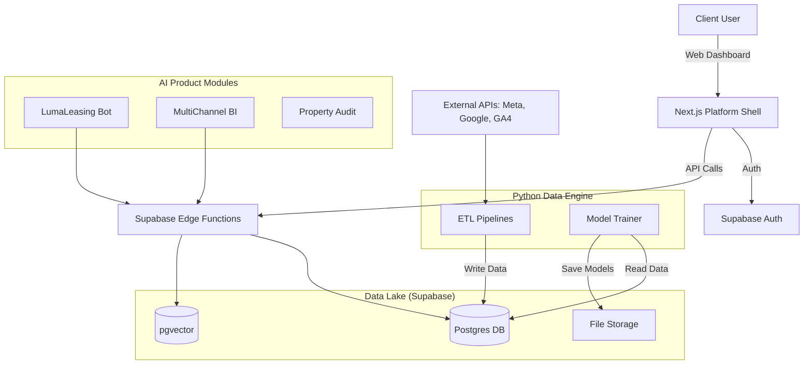

# P11 Creative: Autonomous Agency Platform - MVP Implementation Plan

**Date:** December 8, 2025  
**Prepared For:** Director of Product (Jesse Gill)  
**Goal:** Build the unified platform ecosystem to host 50+ AI products, starting with the Q1 2026 MVP.

---

## 1. Architecture Overview: The Platform Ecosystem

We are not building 50 separate apps. We are building **one unified platform** ("The P11 Console") that hosts multiple modular products. This ensures a consistent client experience, unified data, and easier maintenance.

### Core Stack
*   **Frontend:** Next.js (React) - Unified Dashboard Shell.
*   **Backend:** Supabase (Postgres DB, Auth, Edge Functions, Realtime).
*   **Data/ML Layer:** Python (FastAPI/Scripts) for heavy ETL and Model Training.
*   **Infrastructure:** Vercel (Frontend/Edge) + Supabase (Data/Auth) + AWS/GCP (Training Instances).

### System Diagram



---

## 2. Phase 1: The Core Platform (Weeks 1-4)

**Objective:** Build the "empty" shell that users log into, which will eventually house all tools.

### Step 1.1: Repo & Project Structure
Create a monorepo to house the platform and shared packages.
*   `apps/platform`: The main Next.js dashboard.
*   `packages/ui`: Shared component library (buttons, tables, cards) to ensure brand consistency across products.
*   `packages/db`: Supabase client and typed schema.
*   `services/data-engine`: Python ETL scripts.

### Step 1.2: Database & Auth Setup (Supabase)
*   **Auth:** Enable Email/Password and SSO (for Enterprise clients).
*   **RLS (Row Level Security):** Critical.
    *   `organizations` table: Represents a Property Management Company.
    *   `properties` table: Represents an individual apartment complex.
    *   `profiles` table: Links users to Organizations.
    *   **Policy:** Users can only see data for Properties in their Organization.

### Step 1.3: The Dashboard Shell
Build the standardized layout:
*   **Sidebar Navigation:** Dynamic list of enabled products (e.g., if a client only pays for LumaLeasing, they only see LumaLeasing).
*   **Global Context:** "Property Switcher" dropdown in the header (select "The Reserve at Sandpoint" -> Dashboard updates to show data for that property).
*   **User Management:** Invite team members, assign roles (Admin, Viewer).

---

## 3. Phase 2: Data Lake Foundation (Weeks 3-8)

**Objective:** Fill the `Data Lake` with real-time marketing data (Tier 0 Priority).

### Step 3.1: Python ETL Service
We need a robust data ingestion engine.
*   **Stack:** Python 3.11 + `dlt` (Data Load Tool) or custom scripts.
*   **Structure:**
    ```text
    services/data-engine/
    ├── pipelines/
    │   ├── meta_ads.py      # P11-56
    │   ├── google_ads.py    # P11-57
    │   └── ga4.py           # P11-58
    ├── utils/
    │   ├── supabase_client.py
    │   └── normalization.py
    └── main.py              # Scheduler/Entrypoint
    ```

### Step 3.2: Data Standardization
Don't just dump raw JSON. Normalize data into "Universal" tables:
*   `fact_daily_spend`: Date, PropertyID, Channel (Meta/Google), Spend, Impressions, Clicks.
*   `fact_leads`: Date, PropertyID, Source, LeadType (Call/Form), Status.
*   **Why?** The MultiChannel BI Tool (Tier 1) will query these unified tables, not the raw API dumps.

### Step 3.3: Automation
*   Run pipelines via GitHub Actions (CRON) or a simple task queue (Celery/BullMQ) if frequency > 1 hour.
*   Start with: Daily sync (Midnight).
*   Upgrade to: Hourly sync (for Q2).

---

## 4. Phase 3: First Product Integration - LumaLeasing (Weeks 6-12)

**Objective:** Launch the Chatbot (Tier 1) integrated into the Platform.

### Step 4.1: The AI Agent (Backend)
*   **Stack:** Supabase Edge Functions (TypeScript) + LangChain/OpenAI.
*   **Knowledge Base:**
    *   Store property documents (FAQs, pet policies, amenities) in `supa_storage`.
    *   Embed text chunks into `pgvector` table `document_embeddings`.
*   **Flow:**
    1.  Incoming Msg -> Edge Function.
    2.  `pgvector` Search -> Find relevant property info.
    3.  LLM Generation -> "Yes, we allow pets with a $50 deposit."
    4.  Response -> SMS/Web Chat.

### Step 4.2: The Client Interface (Frontend)
Inside the Platform Dashboard, create the "LumaLeasing" page:
*   **Inbox:** View chat history between AI and prospects.
*   **Intervention:** Button for human to "Take Over" conversation.
*   **Settings:** Upload PDF brochures (triggers auto-embedding).

---

## 5. Model Training Strategy (How-To)

For products like **LeadPulse** (Predictive Scoring) and **ChurnSignal**, you need custom models. Do **NOT** train these inside the Supabase database or Edge Functions.

### The Workflow
1.  **Data Extraction (The "Feature Store"):**
    *   Write a Python script to query the `Data Lake` (Supabase).
    *   Extract historical rows: `LeadSource`, `TimeOfDay`, `ResponseTime`, `DidConvert (Y/N)`.
    *   Save as `training_data_v1.csv`.

2.  **Training Environment:**
    *   Use a local GPU machine or a cloud notebook (Colab/AWS SageMaker).
    *   **Library:** Scikit-Learn (for simple regression/classification) or XGBoost (for tabular data like leads). **Do not use Deep Learning/LLMs for simple tabular prediction**—it's overkill and harder to explain.

3.  **Model Registry:**
    *   Once the model (`lead_score_model.pkl`) is trained and validated (Accuracy > 80%), upload the file to **Supabase Storage** bucket `models`.

4.  **Inference (Serving the Model):**
    *   **Option A (Simple):** Load the lightweight `.pkl` file inside a Python Edge Function (if supported) or a small containerized Python API (FastAPI) hosted on Fly.io/Railway.
    *   **Option B (Supabase Edge):** Convert logic to TypeScript if simple (e.g., weighted scoring). If complex ML, use an external Python API.

### Instructions for the Data Scientist/Offshore Team
> "I need a binary classification model to predict `is_likely_to_lease`. Query the `fact_leads` table. Use features: [Source, DayOfWeek, InteractionCount]. Output a probability score (0-100). Save the model to the 'models' bucket."

---

## 6. Implementation Checklist (Immediate Next Steps)

### Week 1 (Now)
- [ ] **Initialize Git Repo:** Set up the Next.js + Supabase monorepo structure.
- [ ] **Supabase Setup:** Create the `p11-platform-prod` project.
- [ ] **Auth Implementation:** Configure Supabase Auth with RLS policies for `organizations`.
- [ ] **Job Descriptions:** Post the offshore roles (P11-61) to get the team hiring started.

### Week 2
- [ ] **Dashboard Shell:** Build the sidebar, property switcher, and empty "Home" view.
- [ ] **Data Lake Schemas:** Define the SQL tables for `fact_daily_spend` and API raw tables.
- [ ] **Python Setup:** Create the `services/data-engine` folder and first connection scripts.

### Week 3
- [ ] **Meta Ads Pipeline:** First script to pull data from Meta API -> Supabase.
- [ ] **MultiChannel BI UI:** Create the first chart component using `recharts` or `tremor`.

---

**Expert Note:**
Keep the architecture boring. Monolith Frontend (Next.js), Serverless Backend (Supabase), simple Python scripts for data. Complexity is the enemy of autonomy.

